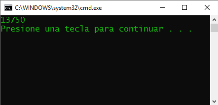
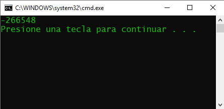
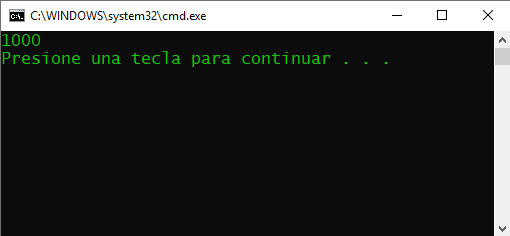
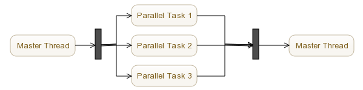
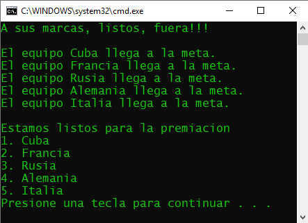
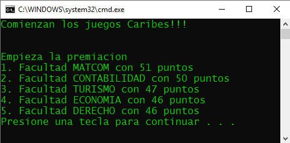
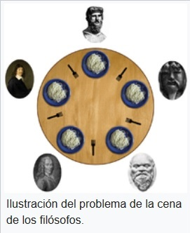

# Concurrencia

## Autor

**Nombre y Apellidos** | **Correo** | **GitHub** 
--|--|--
Ariel Plasencia Díaz | arielplasencia00@gmail.com | [@ArielXL](https://github.com/ArielXL) 

## Introducción

La programación concurrente permite definir tareas que serán ejecutadas de forma simultánea o perceptiblemente simultánea (no necesariamente ejecutarán de forma paralela en núcleos o procesadores independientes). En ocasiones se requiere algún mecanismo de sincronización o puesto de acuerdo entre diversas tareas de forma tal que no utilicen el mismo recurso al mismo tiempo o realicen determinada operación de forma sincronizada. Teniendo en cuenta la idea anterior, nos proponemos abordar el tema de la programación concurrente para el lenguaje programación [C#](https://es.wikipedia.org/wiki/C_Sharp). Para ello, realizaremos adecuadamente las implementaciones de una serie de primitivas de sincronización, todas usando semáforos como tipo principal para restringir o permitir el acceso a recursos compartidos en un entorno de multiprocesamiento. Además, daremos varias soluciones a los clásicos problemas "Los filósofos comensales" y "El barbero dormilón" utilizando las bondades de [Python](https://es.wikipedia.org/wiki/Python).

Cabe señalar que adjuntaremos en la carpeta [*src*](./src) todos los códigos de manera íntegra y funcional propuestos a lo largo de la tarea tanto del lenguaje de programación [C#](https://es.wikipedia.org/wiki/C_Sharp) como [Python](https://es.wikipedia.org/wiki/Python). También incluimos algunos que aunque no se mencionan se hicieron como estudio independiente.

## Principales conceptos

### Programación concurrente

La computación concurrente es la simultaneidad en la ejecución de múltiples tareas interactivas. Estas tareas pueden ser un conjunto de procesos o hilos de ejecución creados por un único programa. Las tareas se pueden ejecutar en una sola unidad central de proceso, en varios procesadores o en una red de computadores distribuidos. La programación concurrente está relacionada con la programación paralela, pero enfatiza más la interacción entre tareas. Así, la correcta secuencia de interacciones o comunicaciones entre los procesos y el acceso coordinado de recursos que se comparten por todos los procesos o tareas son las claves de esta disciplina. Los pioneros en este campo fueron [Edsger Dijkstra](https://es.wikipedia.org/wiki/Edsger_Dijkstra), [Per Brinch Hansen](https://es.wikipedia.org/wiki/Per_Brinch_Hansen), y [C. A. R. Hoare](https://es.wikipedia.org/wiki/C._A._R._Hoare).

Un claro ejemplo de programación concurrente es una aplicación de descarga de música, en la cual puedes descargar un número determinado de canciones al mismo tiempo, cada canción es independiente de la otra, por lo que la velocidad y el tiempo que tarda en descargarse cada una no afectará al resto de las canciones. Esto lo podemos ver como un proceso concurrente, ya que cada descarga es un proceso totalmente independiente del resto.

### Hilos o subprocesos de ejecución

En sistemas operativos, un hilo de ejecución o subproceso es una secuencia de tareas encadenadas muy pequeña que puede ser ejecutada por un sistema operativo.

Los distintos hilos de ejecución comparten una serie de recursos tales como el espacio de memoria, los archivos abiertos, la situación de autentificación, entre otros. Esta técnica permite simplificar el diseño de una aplicación que debe llevar a cabo distintas funciones simultáneamente. Un hilo es simplemente una tarea que puede ser ejecutada al mismo tiempo que otra tarea. Los hilos de ejecución que comparten los mismos recursos, sumados a estos recursos, son en conjunto conocidos como un proceso. El hecho de que los hilos de ejecución de un mismo proceso compartan los recursos hace que cualquiera de estos hilos pueda modificar estos recursos. Lo que es propio de cada hilo es el contador de programa, la pila de ejecución y el estado del CPU (incluyendo el valor de los registros).

#### Funcionalidad de los hilos

Al igual que los procesos, los hilos poseen un estado de ejecución y pueden sincronizarse entre ellos para evitar problemas de compartición de recursos. Generalmente, cada hilo tiene una tarea específica y determinada, como forma de aumentar la eficiencia del uso del procesador.

#### Estados de un hilo

Los principales estados de los hilos son: ejecución, listo y bloqueado. No tiene sentido asociar estados de suspensión de hilos ya que es un concepto de proceso.

#### Cambio de estados de los hilos

* Creación: Cuando se crea un proceso se crea un hilo para ese proceso. Luego, este hilo puede crear otros hilos dentro del mismo proceso, proporcionando un puntero de instrucción y los argumentos del nuevo hilo. El hilo tendrá su propio contexto y su propio espacio de la columna, y pasará al final de los subprocesos listos.

* Bloqueo: Cuando un hilo necesita esperar por un suceso, se bloquea (salvando sus registros de usuario, contador de programa y punteros de pila). Ahora el procesador podrá pasar a ejecutar otro hilo que esté al principio de los subprocesos listos mientras el anterior permanece bloqueado.

* Desbloqueo: Cuando el suceso por el que el hilo se bloqueó se produce, el mismo pasa al final de los subprocesos listos.

* Terminación: Cuando un hilo finaliza se liberan tanto su contexto como sus columnas.

#### Ventajas de los hilos contra procesos

Los beneficios de los hilos se derivan de las implicaciones de rendimiento:

1. Se tarda mucho menos tiempo en crear un hilo nuevo en un proceso existente que en crear un proceso.

2. Se tarda mucho menos en terminar un hilo que un proceso.

3. Se tarda mucho menos tiempo en cambiar entre dos hilos de un mismo proceso.

4. Los hilos aumentan la eficiencia de la comunicación entre programas en ejecución. En la mayoría de los sistemas en la comunicación entre procesos debe intervenir el núcleo para ofrecer protección de los recursos y realizar la comunicación. En cambio, los hilos pueden comunicarse entre sí sin la invocación al núcleo.

### Bloqueo mutuo (deadlock)

En sistemas operativos, el bloqueo mutuo o interbloqueo es el bloqueo permanente de un conjunto de procesos o hilos de ejecución en un sistema concurrente que compiten por recursos del sistema o bien se comunican entre ellos. A diferencia de otros problemas de concurrencia de procesos, no existe una solución general para los interbloqueos. Todos los interbloqueos surgen de necesidades que no pueden ser satisfechas, por parte de dos o más procesos.

En la vida real, un ejemplo puede ser el de dos niños que intentan jugar a "bailar el trompo", uno toma el trompo y el otro el cordel. Ninguno puede jugar hasta que alguno libere lo que tomó.

### Sección o región crítica

Se denomina sección crítica, en programación concurrente, a la porción de código de un programa de ordenador en la que se accede a un recurso compartido que no debe ser accedido por más de un proceso o hilo en ejecución. La región crítica por lo general termina en un tiempo determinado y el hilo, proceso o tarea sólo tendrá que esperar un período determinado de tiempo para entrar. Se necesita un mecanismo de sincronización en la entrada y salida de la sección crítica y así asegurar la utilización exclusiva del recurso. El acceso concurrente se controla teniendo cuidado de las variables que se modifican dentro y fuera de la sección crítica. La región crítica se utiliza por lo general cuando un programa multihilo actualiza múltiples variables sin un hilo de ejecución separado que lleve los cambios conflictivos a esos datos. Una situación similar, la sección crítica puede ser utilizada para asegurarse de que un recurso compartido, por ejemplo, una impresora, pueda ser accedida por un solo proceso a la vez.

### Exclusión mutua

Los algoritmos de exclusión mutua se usan en programación concurrente para evitar el ingreso a sus secciones críticas por más de un proceso a la vez. La sección crítica es el fragmento de código donde puede modificarse un recurso compartido. La mayor parte de estos recursos son las señales, contadores, estructuras de datos y otros datos que se emplean en la comunicación entre el código que se ejecuta cuando se da servicio a una interrupción y el código que se ejecuta el resto del tiempo. Se trata de un problema de vital importancia porque, si no se toman las precauciones debidas, una interrupción puede ocurrir entre dos instrucciones cualesquiera del código normal y esto puede provocar graves fallos.

### Condición de carrera (race condition)

Es una expresión usada en programación cuando la salida o estado de un proceso es dependiente de una secuencia de eventos que se ejecutan en orden arbitrario y van a trabajar sobre un mismo recurso compartido, se puede producir un bug cuando dichos eventos no se ejecutan en el orden que el programador esperaba. El término se origina por la similitud de dos procesos compitiendo en carrera por llegar antes que el otro, de manera que el estado y la salida del sistema dependerán de cuál llegó antes pudiendo provocarse inconsistencias, comportamientos impredecibles como diferentes resultados cuando se ejecuta varias veces el mismo código y no compatibles con un sistema determinista.

Ejemplos de condiciones de carreras que podemos encontrar en la vida cotidiana:

1. Un sistema mal diseñado de reserva de entradas podría ocasionar que dos usuarios accediendo a la vez, reserven legítimamente la misma butaca en un teatro.

2. Un sistema de conteo automático de plazas libres de un parqueo en sus barreras de entrada y salida de vehículos podría indicar que está totalmente vacío cuando realmente está lleno (o viceversa).

3. Dos personas retirando y sacando efectivo a la vez de una misma cuenta bancaria podrían ver su saldo incrementado o por el contrario su ingreso realizado pero no materializado en saldo disponible.

Si los procesos que están en condición de carrera son correctamente sincronizados, todo debería funcionar correctamente, por lo que el resultado será el esperado. Múltiples procesos se encuentran en condición de carrera si el resultado de los mismos depende del orden de su llegada y si no son correctamente sincronizados, puede producirse una corrupción de datos, que puede derivar incluso en un problema de seguridad del sistema capaz de ser explotado de forma malintencionada.

## Un simple ejemplo

Un sencillo ejemplo donde se ponen de manifiesto algunos de los conceptos mencionados con anterioridad es el siguiente.

```c#
public class Cuenta {
    public string Titular { get; private set; }
    public float Saldo { get; protected set; }

    public Cuenta(string titular, float saldoInicial) {
        Titular = (string)titular.Clone();
        if (saldoInicial < 0)
            throw new Exception("Hay que abrir una cuenta con saldo mayor que 0.");
        Saldo = saldoInicial;
    }
    public void Deposita(float cantidad) {
        if (cantidad <= 0)
            throw new Exception("Cantidad a depositar debe ser mayor que cero.");
        Saldo += cantidad;
    }
    public virtual void Extrae(float cantidad) {
        if (cantidad <= 0)
            throw new Exception("Cantidad a extraer debe ser mayor que cero.");
        Saldo -= cantidad;
    }
}
```

En la clase anterior cabe señalar que la opción set del atributo *Saldo* debe ser protected, así como la función *Extrae* posee el modificador virtual. Todo esto se debe por el principio de la clarividencia ya que en clases futuras pudiera ser necesario redefinir la acción *Extrae* y cambiar el valor de la propiedad *Saldo*. Un ejemplo de esto sería una nueva clase hija *CuentaCrédito*, la cual redefine el método *Extrae* de tal manera que cobre un determinado por ciento en caso de que el saldo quede negativo.

```c#
class Program {
    public static void DepositaUno(Cuenta cuenta) {
        for (int i = 0; i < 1000000; i++) {
            cuenta.Deposita(1);
        }
    }
    public static void ExtraeUno(Cuenta cuenta) {
        for (int i = 0; i < 1000000; i++) {
            cuenta.Extrae(1);
        }
    }
    static void Main(string[] args) {
        Cuenta cuentaAriel = new Cuenta("Ariel", 1000);
        Thread hiloDeposita = new Thread(() => DepositaUno(cuentaAriel));
        Thread hiloExtrae = new Thread(() => ExtraeUno(cuentaAriel));

        hiloDeposita.Start();
        hiloExtrae.Start();
        hiloDeposita.Join();
        hiloExtrae.Join();

        Console.WriteLine(cuentaAriel.Saldo);
    }
}
```

Notemos que el código anterior crea una instancia de la clase *Cuenta* con saldo inicial $1000$ y ejecuta dos hilos. En el primero, mediante la función *DepositaUno*, se aumenta en uno el saldo de la cuenta $10^{6}$ veces, mientras que en el segundo hilo, mediante el método *ExtraeUno*, se disminuye en uno el saldo de la cuenta mediante un ciclo que se ejecuta $10^{6}$ veces. Al finalizar la ejecución del programa anterior podemos percatarnos de resultados un tanto inesperados ya que obtenemos valores distintos por cada ejecución. Ejemplos de estos valores son: $-22764$, $10000$, $52962$, $-82578$, entre otros.

**Salida 1** | **Salida 2** | **Salida 3**
--|--|--
 |  | 

Estos resultados se deben fundamentalmente a la presencia de dos secciones críticas en el código, cada vez que se aumenta o disminuye en uno la propiedad *Saldo* de la clase *Cuenta*, estos son claros ejemplos de condiciones de carreras. Para solucionar este error nos auxiliaremos de las primitivas o mecanismos de sincronización.

## Primitivas de sincronización

Los mecanismos o primitivas de sincronización son las encargadas de coordinar operaciones recurrentes que garanticen los resultados esperados de la ejecución. Son particularmente importantes en los casos en que varios hilos puedan acceder a datos comunes. Como ejemplos de mecanismos de sincronización en el lenguaje de programación [C#](https://es.wikipedia.org/wiki/C_Sharp) encontramos: semáforos (semaphores), monitores (monitors), barreras (barriers) y eventos por cuenta atrás (countdowns events).

### Semáforos (semaphores)

Los semáforos fueron inventados por [Edsger Dijkstra](https://es.wikipedia.org/wiki/Edsger_Dijkstra) en 1965 y usados por primera vez en el sistema operativo THEOS. En [C#](https://es.wikipedia.org/wiki/C_Sharp), los semáforos permiten que solo un número limitado de subprocesos entren en una sección crítica. Se usa principalmente en escenarios donde tenemos un número limitado de recursos y tenemos que restringir el número de subprocesos que pueden usarlo. Veamos a continuación algunos de sus principales métodos:

* ***Semaphore(int initialCount, int maximumCount)***: Inicializa una nueva instancia de la clase *Semaphore*, especificando el número inicial de entradas y el número máximo de entradas simultáneas.

* ***void WaitOne()***: Bloque el hilo actual hasta que el *WaitHandle* actual reciba una señal.

* ***void Release()***: Sale del semáforo y devuelve el recuento anterior.

Podemos percatarnos que los semáforos son variables de tipo *Int32* almacenadas en los recursos del sistema operativo. Cuando inicializamos el objeto semáforo, lo hacemos con un número. Este número limita los hilos que pueden entrar en una determinada sección crítica. Cuando un subproceso entra en una región crítica, disminuye la variable *Int32* en uno mediante el método *WaitOne*, por el contrario cuando sale de una región crítica, aumenta la variable *Int32* un uno por la función *Release*. Cuando dicha variable es cero, ningún subproceso puede entrar a la sección crítica, restringiendo así el número de subprocesos.

Con el objetivo de aterrizar estos conceptos presentaremos un ejemplo que pone de manifiesto lo mencionado con anterioridad. El problema del productor-consumidor es un problema clásico de hilos cooperante. En esencia, se trata de dos hilos que cooperan entre sí para solucionar un problema. Uno de ellos recibe el calificativo de "productor" porque su labor es generar datos y almacenarlos, por ejemplo, en un array circular, y el otro recibe el calificativo de "consumidor" porque su labor es extraer de la lista circular los datos generados por el productor. Es obvio que muchas aplicaciones de la vida ordinaria reproducen este problema. Un ejemplo es el administrador de impresión en un servidor de red; los productores son los usuarios de la red y los consumidores las impresoras.

El problema trata de una zona de datos compartida por ambos hilos, con las siguientes particularidades:

1. El productor no puede depositar datos en la matriz si está llena, sólo puede hacerlo si hay elementos vacíos. Esto exige un elemento de sincronización, por ejemplo, un semáforo contador que nos indique si hay elementos vacíos, con un valor inicial igual al tamaño de la matriz (inicialmente todos los elementos están vacíos; semáforo libre).

2. El consumidor no puede recoger datos de la matriz si está vacía, sólo si hay al menos un elemento. Esto exige un elemento de sincronización, por ejemplo, un semáforo contador que nos indique si hay elementos, con valor inicial cero (inicialmente hay cero elementos; semáforo ocupado).

3. Partiendo de que la matriz inicialmente está vacía y que el productor está ejecutando la operación de depositar un dato, el consumidor no puede recogerlo hasta que el productor haya finalizado su operación, y viceversa, como todos los datos están consecutivos en la matriz, el productor debe esperar a que el consumidor termine de recoger un dato para depositar uno. Esto es porque sólo un hilo puede acceder a la matriz a la vez. El hilo tiene que ejecutar una sección crítica, lo que requiere utilizar un semáforo binario adicional.

```c#
namespace Semaphores {
    public class Almacen {
        public int[] Datos { get; private set; }
        public int IndiceProductor { get; private set; }
        public int IndiceConsumidor { get; private set; }
        private Semaphore bloqueo { get; set; }     // exclusion mutua
        private Semaphore vacios { get; set; }      // contador de elementos vacios
        private Semaphore llenos { get; set; }      // contador de elementos llenos

        public Almacen(int cantidad) {
            Datos = new int[cantidad];
            IndiceProductor = 0;
            IndiceConsumidor = 0;
            bloqueo = new Semaphore(1, 1);
            vacios = new Semaphore(cantidad, cantidad);
            llenos = new Semaphore(0, cantidad);
        }
        public void Producir(int elemento) {
            vacios.WaitOne();       // decrementar el contador de elementos vacios
            bloqueo.WaitOne();      // entrada de la seccion critica
            Datos[IndiceProductor] = elemento;
            IndiceProductor = (IndiceProductor + 1) % Datos.Length;
            Thread.Sleep(TimeSpan.FromSeconds(2));
            bloqueo.Release();      // salida de la seccion critica
            llenos.Release();       // incrementar el contador de elementos llenos
        }
        public int Consumir() {
            llenos.WaitOne();       // decrementar el contador de elementos llenos
            bloqueo.WaitOne();      // entrada de la seccion critica
            int elemento = Datos[IndiceConsumidor];
            IndiceConsumidor = (IndiceConsumidor + 1) % Datos.Length;
            Thread.Sleep(TimeSpan.FromSeconds(2));
            bloqueo.Release();      // salida de la seccion critica
            vacios.Release();       // incrementar el contador de elementos vacios
            return elemento;
        }
    }

    class Program {
        public static void Productor(Almacen almacen) {
            Random random = new Random();
            while (true) {
                int elemento = random.Next(0, 100);
                almacen.Producir(elemento);
                Console.ForegroundColor = ConsoleColor.DarkGreen;
                Console.WriteLine($"Se produce el numero {elemento}.");
                Console.ResetColor();
                Thread.Sleep(TimeSpan.FromSeconds(random.Next(0, 2)));
            }
        }
        public static void Consumidor(Almacen almacen) {
            Random random = new Random();
            while (true) {
                int elemento = almacen.Consumir();
                Console.ForegroundColor = ConsoleColor.Red;
                Console.WriteLine($"Se consume el numero {elemento}.");
                Console.ResetColor();
                Thread.Sleep(TimeSpan.FromSeconds(random.Next(8, 10)));
            }
        }
        static void Main(string[] args) {
            Almacen almacen = new Almacen(10);
            Thread hiloProductor = new Thread(() => Productor(almacen));
            Thread hiloConsumidor1 = new Thread(() => Consumidor(almacen));
            Thread hiloConsumidor2 = new Thread(() => Consumidor(almacen));

            hiloProductor.Start();
            hiloConsumidor1.Start();
            hiloConsumidor2.Start();
            hiloProductor.Join();
            hiloConsumidor1.Join();
            hiloConsumidor2.Join();
        }
    }
}
```

En el problema del productor y del consumidor los recursos que estos hilos deben adquirir para poder ejecutarse son los elementos vacíos y los elementos llenos de la matriz, respectivamente. Cada uno de estos tipos de recursos los representaremos por sendas variables que actuarán como semáforos: *llenos* y *vacios*. Un valor cero equivale a semáforo en rojo y un valor distinto de cero a semáforo en verde.

El objeto *llenos* es un semáforo inicialmente en rojo para el consumidor (porque no hay ningún elemento) que representa los elementos actualmente llenos en la matriz y *vacios* es un semáforo inicialmente en verde para el productor (porque la lista se encuentra vacía) que representa los elementos actualmente vacíos de la matriz. Por lo tanto, el contador de *llenos* debe valer inicialmente cero mientras que *vacios* debe valer *Datos.Length*. Cuando un hilo necesita un recurso de un tipo particular, decrementa el contador del semáforo correspondiente, y cuando lo libera lo incrementa.

### Monitores (monitors)

Un monitor es un mecanismo para garantizar que solo un subproceso a la vez pueda ejecutar una determinada pieza de código o región crítica. Un monitor posee un candado, y solo un hilo a la vez puede adquirirlo. Siempre está asociado a un objeto específico y no se puede disociar ni reemplazar dentro de ese objeto. Dicho mecanismo tiene las siguientes características:

1. Está asociado a un objeto bajo demanda.

2. No está vinculado, lo que significa que se puede llamar directamente desde cualquier contexto.

3. No se puede crear una instancia de la clase *Monitor*.

La siguiente información se mantiene para cada objeto sincronizado:

1. Una referencia al hilo que actualmente tiene el candado.

2. Una referencia a una cola, que mantiene los subprocesos que están listos para obtener el bloqueo.

3. Una referencia a una cola de espera, que contiene los subprocesos que están esperando la notificación de un cambio en el estado del objeto bloqueado.

#### Implementación de la clase MyMonitor

Nuestra propuesta es la implementación de la clase estática *MyMonitor*, la cual proporciona un mecanismo que sincroniza el acceso a los objetos. Es una colección de métodos estáticos que nos provee el acceso al monitor asociado con un objeto en particular, que se especifica a través del primer argumento del método. Sus funciones son:

* ***bool IsEntered(object obj)***: Determina si el subproceso actual mantiene el bloqueo en el objeto especificado. Devuelve *true* si el subproceso actual tiene el bloqueo *obj*, en caso contrario, devuelve *false*.

* ***void Enter(object obj)***: Adquiere un bloqueo exclusivo en el objeto especificado.

* ***void Exit(object obj)***: Libera un bloqueo exclusivo en el objeto especificado.

* ***bool Wait(object obj)***: Libera el bloqueo en un objeto y bloquea el subproceso actual hasta que vuelva a adquirir el bloqueo. Devuelve true si la llamada fue devuelta porque el llamador volvió a adquirir el bloqueo para el objeto especificado. Este método no devuelve ningún resultado si el bloqueo no vuelve a adquirirse.

* ***void Pulse(object obj)***: Notifica un cambio de estado del objeto bloqueado al subproceso que se encuentra en la cola de espera.

* ***void PulseAll(object obj)***: Notifica un cambio de estado del objeto a todos los subprocesos que se encuentran en espera.

```c#
public static class MyMonitor {
    private static Dictionary<object, OtherMonitor> dictionary =
                                        new Dictionary<object, OtherMonitor>();
    private static Semaphore monitor = new Semaphore(1, 1);

    public static bool IsEntered(object obj) {
        if (dictionary[obj].ActThread == Thread.CurrentThread.ManagedThreadId)
            return true;
        else
            return false;
    }
    public static void Enter(object obj) {
        monitor.WaitOne();
        if (!dictionary.ContainsKey(obj))
            dictionary.Add(obj, new OtherMonitor());
        monitor.Release();
        dictionary[obj].Enter();
    }
    public static void Exit(object obj) {
        dictionary[obj].Exit();
    }
    public static bool Wait(object obj) {
        return dictionary[obj].Wait();
    }
    public static void Pulse(object obj) {
        dictionary[obj].Pulse();
    }
    public static void PulseAll(object obj) {
        dictionary[obj].PulseAll();
    }
}
```

Como podemos percatarnos en dicha clase existe un miembro privado de tipo *Dictionary<object, SimpleMonitor>* que permite acceder a partir de un objeto dado al monitor que lo supervisa. A la hora de llamar a alguno de los métodos de la clase estática *MyMonitor* que permite trabajar con algún objeto *obj* se comprueba si dicho objeto está en el diccionario y de ser así se redirige el llamado al monitor correspondiente. La clase *SimpleMonitor* es la encargada de manipular los monitores de forma individual e independiente.

#### Resolviendo el ejemplo de la sección 1.3.1

Como dijimos en la sección 1.3.1, el ejemplo propuesto tiene la presencia de dos regiones críticas, cada vez que modificamos el atributo *Saldo* de la clase *Cuenta*. Con los conocimientos obtenidos en este epígrafe podemos arreglar este error.

```c#
class Program {
    public class Cuenta {
        public string Titular { get; private set; }
        public float Saldo { get; protected set; }
        private object obj { get; set; }

        public Cuenta(string titular, float saldoInicial) {
            obj = new object();
            Titular = (string)titular.Clone();
            if (saldoInicial < 0)
                throw new Exception("Hay que abrir una cuenta con saldo mayor que 0.");
            Saldo = saldoInicial;
        }
        public void Deposita(float cantidad) {
            if (cantidad <= 0)
                throw new Exception("Cantidad a depositar debe ser mayor que cero.");
            MyMonitor.Enter(obj);
            Saldo += cantidad;
            MyMonitor.Exit(obj);
        }
        public virtual void Extrae(float cantidad) {
            if (cantidad <= 0)
                throw new Exception("Cantidad a extraer debe ser mayor que cero.");
            MyMonitor.Enter(obj);
            Saldo -= cantidad;
            MyMonitor.Exit(obj);
        }
    }
    public static void DepositaUno(Cuenta cuenta) {
        for (int i = 0; i < 1000000; i++) {
            cuenta.Deposita(1);
        }
    }
    public static void ExtraeUno(Cuenta cuenta) {
        for (int i = 0; i < 1000000; i++) {
            cuenta.Extrae(1);
        }
    }
    static void Main(string[] args) {
        Cuenta cuentaAriel = new Cuenta("Ariel", 1000);
        Thread hiloDeposita = new Thread(() => DepositaUno(cuentaAriel));
        Thread hiloExtrae = new Thread(() => ExtraeUno(cuentaAriel));

        hiloDeposita.Start();
        hiloExtrae.Start();
        hiloDeposita.Join();
        hiloExtrae.Join();

        Console.WriteLine(cuentaAriel.Saldo);
    }
}
```

Al ejecutar el código anterior obtenemos $1000$ !!!



### Eventos por cuenta atrás (countdowns events)

Son un mecanismo de sincronización que desbloquea un hilo en espera cuando recibe la señal un cierto número de veces. Se usa fundamentalmente en escenarios de combinación de bifurcaciones.



Como se muestra en el diagrama anterior, el hilo principal divide su trabajo en tres tareas paralelas. Una vez que se completan todas las tareas paralelas, une sus resultados y el control vuelve al hilo principal.

#### Implementación de la clase MyCountdownEvent

Nuestra propuesta es la implementación de la clase *MyCountdownEvent*, la cual intenta imitar la clase *CountdownEvent* que podemos encontrar en [C#](https://es.wikipedia.org/wiki/C_Sharp). Sus funciones son:

* ***int CurrentCount***: Atributo que obtiene el número de señales restantes necesario para establecer el evento.

* ***int InitialCount***: Propiedad que obtiene los números de señales que se necesitan inicialmente para establecer el evento.

* ***MyCountdownEvent(int initialCount)***: Inicializa una nueva instancia de la clase *MyCountdown* con el recuento especificado.

* ***void AddCount()***: Incrementa en uno el recuento actual de *MyCountdown*.

* ***void Reset()***: Restablece el valor de *CurrentCount* en el valor de *InitialCount*.

* ***bool Signal()***: Registra una señal y disminuye el valor de *CurrentCount*. Devuelve *true* si la señal hizo que el recuento alcanzara el valor cero de lo contrario devuelve *false*.

* ***void Wait()***: Bloquea el subproceso actual hasta que se establezca el objeto *MyCountdown*.

```c#
public class MyCountdownEvent {
    private Semaphore block;
    private Semaphore countdown;
    private int waitingThreads;
    public int CurrentCount { get; private set; }
    public int InitialCount { get; private set; }

    public MyCountdownEvent(int initialCount) {
        InitialCount = initialCount;
        CurrentCount = initialCount;
        waitingThreads = 0;
        block = new Semaphore(1, 1);
        countdown = new Semaphore(0, int.MaxValue);
    }
    public void AddCount() {
        block.WaitOne();
        CurrentCount++;
        block.Release();
    }
    public void Reset() {
        block.WaitOne();
        CurrentCount = InitialCount;
        block.Release();
    }
    public bool Signal() {
        block.WaitOne();
        if (CurrentCount > 1) {
            CurrentCount--;
            block.Release();
            return false;
        }
        else {
            countdown.Release(waitingThreads);
            waitingThreads = 0;
            block.Release();
            return true;
        }
    }
    public void Wait() {
        block.WaitOne();
        if (CurrentCount > 0) {
            waitingThreads++;
            block.Release();
            countdown.WaitOne();
        }
        else
            block.Release();
    }
}
```

De acuerdo con la implementación anterior percibimos el uso de dos objetos semáforos; el primero es un semáforo de dos estados que limita la presencia de un sólo hilo a cada uno de los métodos de clase ya que son consideradas secciones críticas, mientras que el segundo semáforo nos ayuda a simular toda la maquinaria de las funciones *Signal* y *Wait*, siendo el último subproceso el encargado de devolver *true* en el método *Signal* y de retomar nuevamente al hilo principal.

#### Un ejemplo sencillo y original

Supongamos que estamos en presencia de una competencia de carreras, por ejemplo, 100 metros planos. Al sonar la señal de arrancada, los atletas, que representan a sus respectivos países, hacen su mayor esfuerzo por llegar primeros a la línea de meta. Para llevar a cabo la premiación, como es de esperarse, hay esperar que finalicen todos los atletas la carrera. Nos daremos la tarea de simular este tipo de competencia.

Algunas observaciones para la simulación del problema anterior:

1. Los atletas serían los hilos.

2. Usamos una variable *countdown* de tipo *MyCountdown* cuyo valor inicial es la cantidad de participantes en la competencia. Esta variable será como un juez, es decir, hace *Signal* cada vez que un atleta (hilo) lleguen a la meta y notifica su lugar. De modo que cuando todos hayan llegado, entonces se finaliza la carrera y empieza la premiación.

```c#
class Program {
    public static string[] teams = { "Cuba", "Francia", "Italia", "Rusia", "Alemania" };
    public static MyCountdownEvent countdown = new MyCountdownEvent(teams.Length);
    public static List<string> places = new List<string>();

    public static void Winner(int team) {
        Random random = new Random();
        while (true) {
            Thread.Sleep(TimeSpan.FromSeconds(random.Next(1, 4)));
            if (random.Next(0, 4) == 0) {
                Console.WriteLine($"El equipo {teams[team]} llega a la meta.");
                places.Add(teams[team]);
                countdown.Signal();
                break;
            }
        }
    }
    public static void RunTeam() {
        for (int i = 0; i < teams.Length; i++) {
            new Thread(() => Winner(i)).Start();
            Thread.Sleep(TimeSpan.FromSeconds(1));
        }
    }
    static void Main(string[] args) {
        Console.WriteLine("A sus marcas, listos, fuera!!!");
        Console.WriteLine();

        new Thread(() => RunTeam()).Start();
        countdown.Wait();
        
        Console.WriteLine();
        Console.WriteLine("Estamos listos para la premiacion");
        for (int i = 0; i < places.Count; i++) {
            Console.WriteLine($"{i + 1}. {places[i]}");
        }
    }
}
```

CUBA CAMPEÓN !!!



### Barreras (barriers)

Las barreras son primitivas de sincronización que permiten que varios subprocesos (conocidos como participantes) trabajen simultáneamente en un algoritmo por fases. Cada participante se ejecuta hasta que alcanza la barrera en el código. La barrera representa el final de una fase de trabajo. Cuando un participante alcanza la barrera, se bloquea hasta que todos los demás participantes alcancen la misma barrera. Cuando todos los participantes alcanzan la barrera, opcionalmente puede invocarse una acción posterior a la fase. Dicha acción posterior puede usarse para realizar acciones con un solo subproceso mientras todos los demás subprocesos siguen bloqueados. Una vez ejecutada la acción, se desbloquean todos los participantes. En fin, dicha primitiva sigue las siguientes características:

1. Permite que múltiples hilos trabajen concurrentemente en un algoritmo por fases.

2. Todos los hilos deben estar en las mismas fases en todo momento, es decir, no hay posibilidad de que subprocesos funcionen en diferentes etapas.

3. Se usan cuando un grupo de tareas cooperan pasando por una serie de etapas.

#### Implementación de la clase MyBarrier

Nuestra propuesta es la implementación de la clase *MyBarrier*, la cual intenta seguir todos los planteamientos propuestos arriba. Sus funciones son:

* ***long CurrentPhaseNumber***: Atributo que obtiene el número de la fase actual de la barrera.

* ***int ParticipantCount***: Propiedad que obtiene el número total de participantes de la barrera.

* ***int ParticipantsRemaining***: Campo que obtiene el número de participantes de la barrera que aún no se han señalado en la fase actual.

* ***MyBarrier(int participantCount)***: Inicializa una nueva instancia de la clase *MyBarrier*.

* ***long AddParticipant()***: Notifica que va a haber un participante adicional. Devuelve el número de fase de la barrera en la que primero participarán los nuevos participantes.

* ***void RemoveParticipant()***: Notifica que va a haber un participante menos.

* ***void SignalAndWait()***: Señala que un participante ha alcanzado la barrera y espera a que todos los demás participantes alcancen también la barrera.

```c#
public class MyBarrier {
    private Semaphore block;
    private Semaphore barrier;
    public int ParticipantCount { get; private set; }
    public long CurrentPhaseNumber { get; private set; }
    public int ParticipantsRemaining { get; private set; }

    public MyBarrier(int participantCount) {
        block = new Semaphore(1, 1);
        barrier = new Semaphore(0, participantCount - 1);
        CurrentPhaseNumber = 1;
        ParticipantCount = participantCount;
        ParticipantsRemaining = participantCount;
    }
    public long AddParticipant() {
        block.WaitOne();
        ParticipantCount++;
        ParticipantsRemaining++;
        block.Release();
        return CurrentPhaseNumber;
    }
    public void RemoveParticipant() {
        block.WaitOne();
        if (ParticipantCount == 0)
            throw new InvalidOperationException();
        ParticipantCount--;
        ParticipantsRemaining--;
        block.Release();
    }
    public void SignalAndWait() {
        block.WaitOne();
        if (ParticipantsRemaining > 1) {
            ParticipantsRemaining--;
            block.Release();
            barrier.WaitOne();
        }
        else {
            barrier.Release(ParticipantCount - 1);
            CurrentPhaseNumber++;
            ParticipantsRemaining = ParticipantCount;
            block.Release();
        }
    }
}
```

Como se puede observar usamos un semáforo binario *block* a modo de un candado de exclusión restringiendo que sólo un hilo tenga acceso a las funciones en un determinado momento. También contamos con otro semáforo *barrier* cuyo valor inicial es cero y es el encargado de limitar los subprocesos hasta una región de código dada, siendo el último hilo el que permita terminar la fase, comenzar una nueva y restablecer los valores para la próxima etapa.

#### Un sencillo y original ejemplo

Para comprender el funcionamiento de esta primitiva les traemos un ejemplo relacionado con la universidad, específicamente con los Juegos Caribes. Los Juegos Caribes consisten en una serie de deportes que se compiten por varias facultades. Con el objetivo de hacer más pareja la competencia (ya que siempre gana la Facultad de Economía) los deportes se jugarán en serie, es decir, hasta que no acabe el primero no puede empezar el segundo y así sucesivamente hasta el último, esto favorece a las facultades con un menor número de estudiantes atletas. Al finalizar cada deporte se entrega una cantidad de puntos para las facultades según el lugar alcanzado. El ganador de los juegos será aquella facultad que acumule la mayor cantidad de puntos en todos los deportes. Les mostramos la cantidad de puntos que alcanzan los siete primeros lugares.

**Lugares** | **Cantidad de puntos**
:-:|:-:
1er lugar | 10
2do lugar | 9
3er lugar | 8
4to lugar | 7
5to lugar | 6
6to lugar | 5
7mo lugar | 4

Algunas particularidades para la simulación del problema anterior:

1. Notar que este problema es muy distinto al propuesto para *countdowns* porque a diferencia del anterior en este hay que esperar que todas las facultades terminen el deporte actual, o sea, se puede afirmar que necesita un algoritmo por múltiples fases.

2. Los hilos o subprocesos serían las facultades.

3. Usamos una variable *barrier* de tipo *MyBarrier* cuyo valor inicial es la cantidad de facultades participantes en la competencia. Esta variable nos servirá para bloquear hasta una determinada sección de código simulando así que se culmine el deporte actual. Al finalizar un deporte se dará por concluida la fase y se comenzará con la próxima etapa.

4. Además, usamos una variable *block* de tipo *Semaphore* que nos ayuda a restringir la región de código a la hora de distribuir las puntuaciones.

5. En una lista se guardan los puntos por facultades, de tal manera que cuando terminen los juegos se pueda inferir un campeón.

```c#
class Program {
    public class Caribes {
        private int winner_faculties { get; set; }
        private int[] points_faculties { get; set; }
        private Thread[] threads_faculties { get; set; }
        private MyBarrier barrier { get; set; }
        private Semaphore block { get; set; }
        public string[] Faculties { get; private set; }
        public string[] Sports { get; private set; }

        public Caribes(string[] faculties, string[] sports) {
            Faculties = (string[])faculties.Clone();
            Sports = (string[])sports.Clone();
            winner_faculties = 0;
            points_faculties = new int[faculties.Length];
            threads_faculties = new Thread[faculties.Length];
            barrier = new MyBarrier(faculties.Length);
            block = new Semaphore(1, 1);
        }
        private void PlaySport(int faculty) {
            Random random = new Random();
            for (int i = 0; i < Sports.Length; i++) {
                winner_faculties = 0;
                while (true) {
                    Thread.Sleep(TimeSpan.FromSeconds(random.Next(1, 4)));
                    if (random.Next(0, 3) == 0) {
                        block.WaitOne();
                        int points = 10 - winner_faculties;
                        points_faculties[faculty] += points;
                        winner_faculties++;
                        block.Release();
                        barrier.SignalAndWait();
                        break;
                    }
                }
                Thread.Sleep(TimeSpan.FromSeconds(1));
            }
        }
        public void Run() {
            for (int i = 0; i < Faculties.Length; i++) {
                int idx = i;
                threads_faculties[idx] = new Thread(() => PlaySport(idx));
            }
            for (int i = 0; i < threads_faculties.Length; i++) {
                threads_faculties[i].Start();
                Thread.Sleep(TimeSpan.FromSeconds(1));
            }
            for (int i = 0; i < threads_faculties.Length; i++) {
                threads_faculties[i].Join();
            }
        }
        public void PrintResults() {
            List<Tuple<int, string>> faculties_points = new List<Tuple<int, string>>();
            for (int i = 0; i < points_faculties.Length; i++) {
                faculties_points.Add(new Tuple<int, string>(
                    								points_faculties[i], Faculties[i]));
            }
            faculties_points.Sort();
            Console.WriteLine("Empieza la premiacion");
            for (int i = faculties_points.Count - 1, j = 0; i >= 0; i--, j++) {
                Console.WriteLine($"{j + 1}. Facultad  
                    {faculties_points[i].Item2} con {faculties_points[i].Item1} puntos");
            }
        }
    }
    static void Main(string[] args) {
        string[] faculties = { "MATCOM","ECONOMIA","DERECHO","TURISMO","CONTABILIDAD" };
        string[] sports = { "Futbol", "Voleibol", "Ajedrez", 
                                            "Natacion", "Beisbol", "Atletismo" };
        Console.WriteLine("Comienzan los juegos Caribes!!!");
        Console.WriteLine();
        Caribes caribes = new Caribes(faculties, sports);
        caribes.Run();
        Console.WriteLine();
        caribes.PrintResults();
    }
}
```

MATCOM CAMPEÓN !!!



## Problema de los filósofos comensales

### Enunciado del problema



Cinco filósofos pasan su vida pensando y comiendo. Los filósofos comparten una mesa circular rodeada por cinco sillas, una para cada uno de ellos. En el centro de la mesa se encuentra una fuente de arroz, y también sobre la mesa hay cinco tenedores. Cuando un filósofo piensa, no interactúa con sus colegas. Ocasionalmente, un filósofo tiene hambre y trata de coger los dos tenedores que están más cerca de él (colocados entre él y sus vecinos de la derecha y de la izquierda). Un filósofo sólo puede coger un tenedor a la vez y, obviamente, no puede ser el que está en la mano de un vecino. Cuando un filósofo hambriento tiene sus dos tenedores al mismo tiempo come sin soltarlos. Cuando termina de comer, coloca ambos tenedores sobre la mesa y comienza a pensar otra vez. El problema consiste en simular las actividades de los filósofos sin que ocurran condiciones de carrera.

### Primeras observaciones

Lo más difícil e importante para este tipo de problemas es identificar las secciones críticas, es decir, los pedazos de código donde sólo pueden haber un número limitado de subprocesos. Si pensamos detenidamente en lo anterior, nos percatamos que dos filósofos adyacentes no pueden cenar a la vez ya que comparten un mismo tenedor. Podemos llegar a la conclusión de que hay que restringir la acción de comer para cada pensador de manera independiente, o sea, cuando un comensal se encuentra cenando, tanto su vecino izquierdo como su vecino derecho no pueden cenar porque tendrían un tenedor en común. Una primera solución, aunque no muy buena, sería que sólo hubiera un pensador comiendo a la vez. Esta idea es conocida en la literatura como solución por turnos y se logra a través de un monitor o semáforo binario. La gran desventaja de dicha solución es que puede pasar mucho tiempo para que un filósofo vuelva a cenar ya que en todo momento la mayor cantidad de filósofos que pueden comer a la vez es uno cuando podrían ser más. El código se encuentra adjunto en la carpeta [*src*](./src) en los lenguajes [C#](https://es.wikipedia.org/wiki/C_Sharp) y [Python](https://es.wikipedia.org/wiki/Python).

### Propuesta de solución

Consideramos que nuestra propuesta de solución es mejor que la anterior y, a continuación la explicamos detalladamente:

1. Primeramente extenderemos el problema para $n$ comensales en lugar de cinco como enuncia el problema original.

2. Tendremos una lista de estados donde para cada posición $i$ $(0 \le i \le n)$ indica el estado actual del filósofo. Según el problema, el estado inicial para todos los filósofos es pensando.

3. Tendremos una lista de semáforos de dos estados tal que cada posición $i$ $(0 \le i \le n)$ denota la usabilidad de los tenedores. Notar que si un filósofo está comiendo entonces bloquea los tenedores de sus lados, de manera que no permite que sus vecinos ejecuten la acción de comer.

4. Si un pensador tiene el estado de hambriento, primero intentará tomar el tenedor izquierdo y luego el derecho, en caso que haya alguno ocupado, el comensal esperará un determinado tiempo para volver a intentar tomar el tenedor ocupado. Si el número de intentos excede a una variable predeterminada por el usuario entonces automáticamente el filósofo suelta los tenedores ocupados y cambia hacia el estado pensando.

5. Cuando un comensal termina de cenar libera los tenedores de sus lados permitiendo que estos puedan ser usados por algún filósofo vecino.

Debido a la gran extensión de la solución sólo pondremos un pseudocódigo de la función principal, aunque los atributos y métodos de la solución son los mostrados a continuación:

* ***self.count_philosopher***: Cantidad total de comensales sentados en la mesa.

* ***self.max_failed***: Cantidad de intentos máximos fallidos para que un comensal deje de tratar de tomar un tenedor.

* ***self.forks***: Representa una lista donde la posición i-ésima $(0 \le i \le n)$ es un semáforo binario que indica si el tenedor puede ser tomado. Como son semáforos binarios su valor inicial es uno.

* ***self.used_fork***: Representa una lista de booleanos donde para cada posición $i$ $(0 \le i \le n)$ indica si el tenedor está siendo usado.

* ***self.state_philosopher***: Representa una lista con el estado para el filósofo $i$ $(0 \le i \le n)$. Los posibles estados son; pensando(thinking), hambriento(hungry), comiendo(eating), tiene el tenedor izquierdo(left_fork), tiene el tenedor derecho(right_fork) y terminó de comer(finished_eat).

* ***get_left_fork(self, id_philosopher)***: Devuelve el tenedor izquierdo del comensal especificado.

* ***get_right_fork(self, id_philosopher)***: Devuelve el tenedor derecho del pensador especificado.

* ***take_left_fork(self, id_philosopher)***: Intenta tomar el tenedor izquierdo del comensal especificado.

* ***take_right_fork(self, id_philosopher)***: Intenta tomar el tenedor derecho del pensador especificado.

* ***release_left_fork(self, id_philosopher)***: Libera el tenedor izquierdo del comensal especificado.

* ***release_right_fork(self, id_philosopher)***: Libera el tenedor derecho del pensador especificado.

* ***eat(self, id_philosopher)***: Función que va ejecutar cada filósofo o hilo para simular la lógica del problema.

* ***start_threads(self)***: Comienza a correr los hilos correspondiente a cada filósofo.

```text
method eat(id_philo)
  while true
    if is_hungry(id_philo)                          // tiene hambre?
      state_philo[id_philo] <- hungry               // cambia a estado "hambriento"
      left_fork <- get_left_fork(id_philo)          // devuelve el tenedor izquierdo
      right_fork <- get_right_fork(id_philo)        // devuelve el tenedor derecho

      if not used_fork(left_fork)                   // tenedor izquierdo no esta ocupado?
        take_left_fork(id_philo)                    // toma el tenedor izquierdo
        failed <- 0
        while True
          if failed = max_failed                    // alcanzo el maximo numero de intentos?
            failed <- 0
            release_left_fork(id_philo)             // libera el tenedor izquierdo
            break                                   // sale porque alcanzo el maximo de intentos
          elif not used_fork(right_fork)            // tenedor derecho no esta ocupado?
            failed <- 0
            take_right_fork(id_philo)               // toma el tenedor derecho
            state_philo[id_philo] <- eating         // cambia a estado "comiendo"
            wait(random(3, 5))                      // simula que esta comiendo
            state_philo[id_philo] <- finished_eat   // cambia a estado "termino de comer"
            release_forks(id_philo)                 // libera ambos tenedores
            break                                   // sale porque pudo comer
          else:
            failed += 1                             // no se pudo tomar el tenedor derecho
          wait(random(1, 3))                        // espera para volver a tomar el tenedor
        state_philo[id_philo] <- thinking           // cambia a estado "pensando"
        wait(random(2, 5))                          // simula que esta pensando
      elif not used_fork(right_fork)                // tenedor derecho no esta usado?
        take_right_fork(id_philo)                   // toma el tenedor derecho
        failed <- 0
        while True
          if failed = max_failed                    // alcanzo el maximo numero de intentos?
            failed <- 0
            release_right_fork(id_philo)            // libera el tenedor derecho
            break                                   // sale porque alcanzo el maximo de intentos
          elif not used_fork(left_fork)             // tenedor izquierdo no esta usado?
            failed <- 0
            take_left_fork(id_philo)                // toma el tenedor izquierdo
            state_philo[id_philo] <- eating         // cambia a estado "comiendo"
            wait(random(3, 5))                      // simula que esta comiendo
            state_philo[id_philo] <- finished_eat   // cambia a estado "termino de comer"
            release_forks(id_philo)                 // libera ambos tenedores
            break                                   // sale porque pudo comer
          else
            failed += 1                             // no se pudo tomar el tenedor izquierdo
          wait(random(1, 3))                        // espera para volver a tomar el tenedor
        state_philo[id_philo] <- thinking           // cambia a estado "pensando"
        wait(random(2, 5))                          // simula que esta pensando
      else
        state_philo[id_philo] <- thinking           // cambia a estado "pensando"
        wait(random(2, 5))                          // simula que esta pensando
    wait(1)                                         // espera para volver a empezar de nuevo
```

## Problema del barbero dormilón

### Enunciado del problema

Una barbería en la que trabaja un barbero que tiene un único sillón de barbero y varias sillas para esperar. Cuando no hay clientes, el barbero se sienta en su sillón y se duerme. Cuando llega un nuevo cliente, éste o bien despierta al barbero o si el barbero está cortándole el cabello a otro cliente se sienta en una silla (o se va si todas las sillas están ocupadas por clientes esperando). El problema consiste en simular las actividades del barbero y de los clientes sin que ocurran condiciones de carrera.

### Algunas observaciones

Primeramente, es fácil darse cuenta que para este problema hacen falta dos hilos; el primero, para generar los clientes que llegan a la barbería y el segundo, para simular las acciones del barbero. Si pensamos detenidamente, nos percatamos de la existencia de una región crítica; compuesta por la cola de clientes, o sea, los dos subprocesos tienen que modificar esta cola y no pueden hacerlo a la vez. Para erradir dicho problema podemos usar un semáforo de dos estados de tal forma que antes y después de realizar cualquier acción sobre la cola de clientes se limite el acceso a un sólo subproceso.

### Propuesta de solución

Ahora presentaremos una explicación detallada de nuestra propuesta de solución:

1. El hilo de generar los clientes se hace mediante la función *generate_clients*. Los nuevos clientes se crean a partir de un identificador *id* y, se cortan el cabello, se encolan o se largan en caso de, estar el barbero durmiendo, haber espacio para sentarse o estar todas las sillas ocupadas respectivamente.

2. El hilo del barbero se lleva a cabo mediante la función *barber*. En este caso hay que tener sumo cuidado cuando el barbero interactúa con la cola de clientes ya que puede ocasionarse un bloqueo mutuo.

3. Los clientes se guardan en una cola con principio FIFO y con una capacidad máxima predeterminada por el usuario.

A continuación enseñaremos los atributos y métodos de nuestra propuesta de solución y luego la clase *SleepyBarber* con la lógica antes mencionada.

* ***self.count_chairs***: Cantidad de sillas que hay para esperar en la barbería.

* ***self.clients***: Representa una cola (con principio FIFO) como estructura de datos que simula la cola de los clientes en espera.

* ***self.id***: Identificación para cada cliente.

* ***self.block***: Semáforo de dos estados para restringir las regiones críticas.

* ***generate_clients(self)***: Función encargada de generar los clientes que llegan a la barbería.

* ***barber(self)***: Función encargada de simular las acciones del barbero.

* ***start_threads(self)***: Comienza a correr los hilos; tanto generar los clientes como las acciones del barbero.

```python
class SleepyBarber:
    def __init__(self, count_chairs=5):
        self.count_chairs = count_chairs
        self.clients = queue.Queue(self.count_chairs)
        self.id = 0
        self.block = threading.Semaphore(1)
        self.start_threads()

    def generate_clients(self):
        while True:
            self.id += 1
            self.block.acquire()
            if self.clients.full():
                print(f'El cliente {self.id} no pudo entrar porque la barberia esta llena.')
            else:
                self.clients.put(self.id)
                print(f'El cliente {self.id} llega a la barberia.')
            self.block.release()
            time.sleep(random.randint(2, 4))

    def barber(self):
        while True:
            self.block.acquire()
            if not self.clients.empty():
                id_client = self.clients.get()
                self.block.release()
                print(f'El barbero comenzo a cortarle el cabello al cliente {id_client}.')
                time.sleep(random.randint(1, 3))
                print(f'El barbero termino de cortarle el cabello al cliente {id_client}.')
                if self.clients.empty():
                    print('El barbero esta durmiendo.')
            else:
                print('El barbero esta durmiendo.')
                self.block.release()
            time.sleep(1)

    def start_threads(self):
        thread_generate_clients = threading.Thread(target=self.generate_clients)
        thread_barber = threading.Thread(target=self.barber)
        
        thread_generate_clients.start()
        thread_barber.start()
        thread_generate_clients.join()
        thread_barber.join()
```

### Algunas simulaciones

También proveemos un algoritmo muy similar al anterior, pero con el objetivo de llevar a cabo distintas simulaciones para este problema. El algoritmo se detiene cuando alcanza la cantidad máxima de clientes. A continuación, algunos resultados:

**Cantidad de sillas** | **Tiempo que se demora el barbero pelando (seg)** | **Tiempo que demoran en llegar los clientes (seg)** | **Cantidad de veces que el barbero se duerme** | **Cantidad de clientes que pudieron entrar** | **Cantidad de clientes que no pudieron entrar** | **Cantidad máxima de clientes** | **Por ciento de los clientes pelados (%)**
--|--|--|--|--|--|--|--
5 | 3 | 2 | 0 | 15 | 5 | 20 | 75.00
10 | 3 | 2 | 0 | 35 | 15 | 50 | 70.00
15 | 1 | 1 | 0 | 45 | 15 | 60 | 75.00
15 | 5 | 2 | 0 | 35 | 25 | 60 | 58.33
15 | 2 | 5 | 176 | 60 | 0 | 60 | 100.00
20 | 2 | 1 | 0 | 54 | 46 | 100 | 54.00
